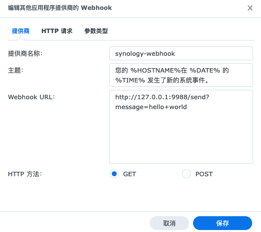

# Webhook-Forward


## Usage


```bash
docker pull starudream/webhook-forward
```

```bash
docker run -d starudream/webhook-forward
```

### Env

```shell
ADDR=127.0.0.1:9988
DEBUG=true

PROXY=http://127.0.0.1:7890 # optional, if use telegram, to call it api
REDIS_DSN=redis://127.0.0.1:6378 # optional, if use weixin, to store access_token

DINGTALK_ENABLE=true
DINGTALK_TOKEN=
DINGTALK_SECRET=

TELEGRAM_ENABLE=true
TELEGRAM_TOKEN=
TELEGRAM_TO=

WEIXIN_ENABLE=true
WEIXIN_ID=
WEIXIN_SECRET=
WEIXIN_AID=
WEIXIN_TO=@all
```

## Synology



## License

[Apache License 2.0](./LICENSE)
